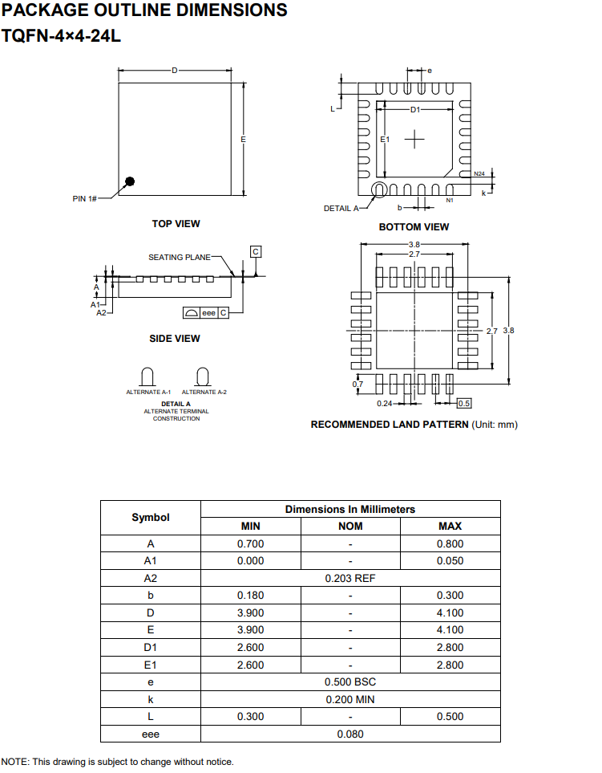
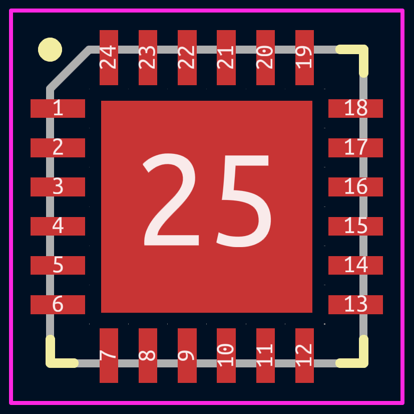
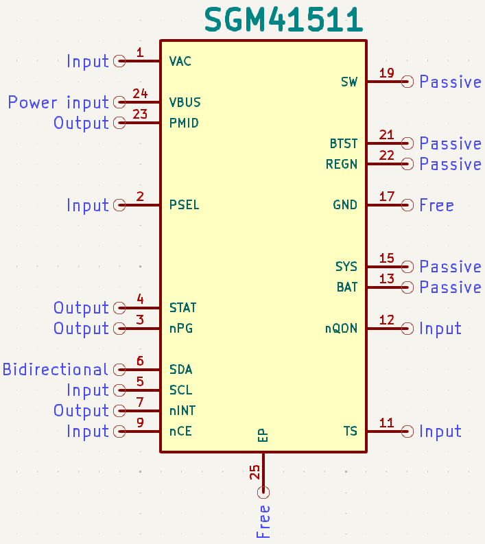

# SGMICRO SGM41511 – Custom KiCad Symbol, Footprint, and 3D Model

During PCB design for a personal engineering project, a symbol, footprint, and 3D model for the **SGM41511 battery charging IC** could not be found in KiCad’s standard libraries or third-party sources.

As a result, a complete custom component was created based on the **TQFN-4×4-24L** package specifications from the [official datasheet](https://www.sg-micro.com/rect/assets/d5875e35-e037-4d49-9050-ad61cb59692c/SGM41511.pdf).

---

## Included in This Repository

- KiCad Symbol  
- KiCad Footprint (TQFN-4x4-24L)  
- STEP 3D Model  
- Reference images from the official datasheet  
- Rendered views for preview and verification  

---

## 3D Model

- STEP model created using **Onshape**
- Nominal values (average of min/max dimensions) were used for pad sizes and body outline
- Aligned and offset in KiCad to match actual footprint origin
- Verified in KiCad’s 3D viewer

### Model Render:

### Reference – Datasheet Package Dimensions (Excerpt):

---

## Footprint

- Created using official TQFN-4x4-24L mechanical dimensions
- Silkscreen, fab, and courtyard layers designed according to **IPC-7351** guidelines
- Verified with KiCad’s **DRC** for clearance and pad compliance

### Footprint Design:

### Reference – Datasheet Pin Configuration (Excerpt):

---

## Symbol

- Designed in KiCad’s Symbol Editor
- All pins named and numbered according to the official datasheet
- Organized following KiCad schematic conventions

### Symbol Design:

### Reference – Pin Description Table (Excerpt):

---